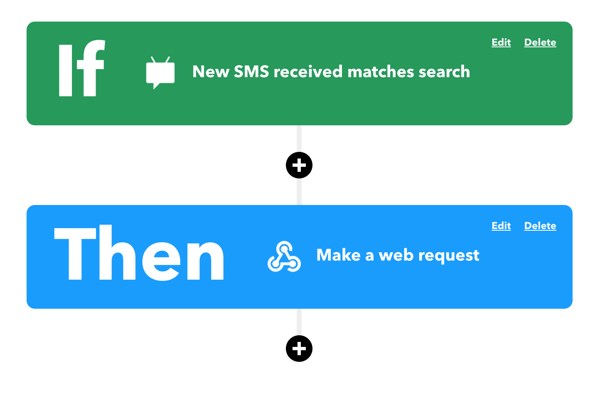

# CoWIN Discord Notifier
Discord Notifier for India's CoWIN 18+ covid vaccine appointments


## Setup

### *Required* - Environment
After cloning this repository, create a `.env` file in the repo with the following contents:
```bash
cowin_discord_bot_token=ENTER_DISCORD_BOT_TOKEN_HERE # for example AAAAAAAAAAAAAAAAAAAAAAAA.XXXXXX.YYYYYYYYYYYYYYYYYYYYYYYYYYY
cowin_phone_number=ENTER_PHONE_NUMBER_HERE # for example 1234567890
cowin_district=ENTER_DISTRICT_NUMBER_HERE # for example 389
cowin_whitelist_vaccine_types=ENTER_TYPES_HERE # for example COVISHIELD,COVAXIN,SPUTNIK V, can be one or more of COVISHIELD,COVAXIN, or SPUTNIK V (only for registering)
cowin_whitelist_center_ids=ENTER_CENTER_IDS_HERE # either a single one like 594721 or multiple like 695512,695508,609123,561538,695505,569351 (only for registering)
cowin_whitelist_times=ENTER_TIMERANGE_HERE # for example 00:00-23:59 (in 24-hour format)
cowin_whitelist_beneficiaries=ENTER_BENEFICIARIES_HERE # either a single one like 20123456789000 or multiple like 20123456789000,20123456789111,20123456789222
cowin_under_45=1 # **NOTE: Only add this if you're filtering for under 45 years**
cowin_whitelist_dose=ENTER_DOSE_NUMBER_HERE # either 1 or 2, whichever dose # you are looking for (only for registering)
```

Make sure to replace the right side with the appropriate information. After you create a discord bot, drop the bot's token in the first variable, then your phone number for a one-time authentication (and in the future, for scheduling appointments quickly), and finally the district number for the district you want to fetch vaccine information for (To find the district number, please follow the steps below)

### *Required* - Install dependencies
Install all dependencies with the following command (using yarn) in the repo folder:
```
yarn
```
Make sure you also have `ts-node` installed, otherwise use either yarn (`yarn add --global ts-node`) or npm (`npm install -g ts-node`) to install it.

### *Required* - Workflow configuration
On the `src/index.ts` file's last line you will notice four booleans, each of which, when toggled to `true`, enables different functionality (in order from left to right):

1. Print the relevant environment variables out
2. Enable discord notifications to all channels your bot is present in (requires the setting of the discord bot token in the `.env` file mentioned at the beginning of this setup section)
3. Enable the booking workflow
4. Enable the automated OTP workflow with the IFTTT integration mentioned further below

### How to find your State and then District Number
1. Visit https://cdn-api.co-vin.in/api/v2/admin/location/states to find your state and the `state_id` corresponding it (For example, for Maharashtra, it is `21`)
2. Now, take your state number and append it at the end of the following URL: https://cdn-api.co-vin.in/api/v2/admin/location/districts/ (For example, for Maharashtra, it will be https://cdn-api.co-vin.in/api/v2/admin/location/districts/21).
3. Visit this new url to find out the `district_id` corresponding to your district to get the district number (for example, for the Nashik district in Maharashtra, it is 389).

### How to find Center IDs
1. First follow the above steps to find your district number.
2. Then visit https://cdn-api.co-vin.in/api/v2/appointment/sessions/calendarByDistrict?district_id=DISTRICT_NUMBER&date=DD-MM-YYYY where `DISTRICT_NUMBER` is what you determined above and DD-MM-YYYY is the current date in that particular format.
3. You'll find an array of centers presented to you, where you can pick which centers you want to whitelist (each center's `center_id` field), and if you choose not to whitelist them, then slots available from any center will be booked.


## Running the application
Run the application with the following command:
```
ts-node src/index.ts
```

### Running the IFTTT workflow
To run the IFTTT workflow, installing `ngrok` is highly suggested, unless you already have public http access setup for your machine. To install `ngrok`, you can visit https://ngrok.com/download.
Once `ngrok` is installed, in a new terminal window, all you need to do is run the following:
```
ngrok http 3000
```
And you will be presented with a public URL pointing to your machine's port 3000, for example, http://0ec9d61d2ad5.ngrok.io, which you will need later on.

Once ngrok is setup, you then need to sign up on https://ifttt.com/ and create your own applet with the following two steps for the "If" and the "Then" steps respectively:


For each of the two steps, you must have the following configuration:

The SMS step configuration:
The contents of the single field must match the text in the following picture.


The Webhook step configuration:

***NOTE: you must modify the URL to be the one you got from the `ngrok` output.***
You can fill out all the other fields exactly as shown in the picture below.
